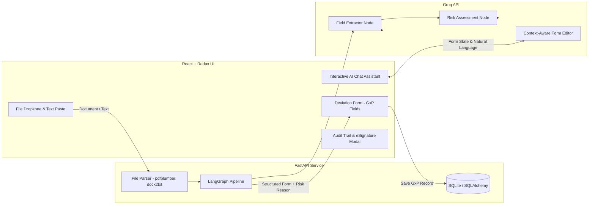

# AI-Powered Deviation Intake Module (AIVOA)

An enterprise-ready, GxP-compliant Deviation Intake System for pharmaceutical manufacturing quality management (QMS). Powered by **FastAPI**, **LangGraph**, **Groq (LLMs)**, and **React + Redux Toolkit**.

This system automates the ingestion, extraction, and risk assessment of manufacturing deviations from unstructured text and documents (PDF, DOCX, TXT), reducing logging latency and standardizing risk categorization.

---

## Architecture Overview



---

## Key Features

1. **Automated Multi-Format Document Ingestion**
   - Ingests `.pdf`, `.docx`, and `.txt` deviation logs, emails, or shift handovers.
   - Extracts core fields: Plant / Site, Occurrence Date, Source Department, Related Product/Material, Batch/Lot Number, Title, and Technical Description.

2. **GxP-Compliant Risk & Severity Assessment (LangGraph Engine)**
   - Two-step state graph pipeline:
     - **Extraction Node**: Strict JSON schema normalization (ISO dates, department tagging).
     - **Risk Assessment Node**: Classifies **Initial Impact** and **Initial Severity** according to pharmaceutical compliance rules:
       - **Impacts**: *Product Quality & Identity*, *Patient Safety Direct Risk*, *Regulatory / Statutory Breach*, *Operational Process Only*.
       - **Severities**: *Critical (Batch Rejection Likely)*, *Major (Requires Formal CAPA)*, *Minor (Immediate Remediation)*.
     - Provides natural language justification for the recommended classification.

3. **Interactive AI Chat & Live Form Synchronization**
   - Natural language commands in chat dynamically update the form state (e.g., *"Change severity to Critical"*, *"Update batch number to B-9982"*).
   - Conversational Q&A grounded on current form values.

4. **Pharmaceutical Grade UI & Compliance Workflow**
   - Modern Tailwind CSS interface designed specifically for Quality Assurance & Operations.
   - Built-in GxP ID generator (`DEV-YYYY-XXXX`).
   - 21 CFR Part 11 compliant workflow readiness (Audit Trail, Electronic Signatures / Confirmation modals).

---

## Tech Stack

- **Frontend**:
  - React 19 + Vite
  - Redux Toolkit (`deviationSlice` with async thunks)
  - Tailwind CSS + Material Symbols
- **Backend**:
  - FastAPI + Uvicorn
  - LangChain & LangGraph
  - Groq LLM API (`openai/gpt-oss-20b`)
  - SQLAlchemy & SQLite
  - `pdfplumber`, `docx2txt`
- **Data Validation**: Pydantic v2

---

## Project Structure

```text
logdev/
├── backend/
│   ├── db.py               # SQLAlchemy models & SQLite setup
│   ├── graph.py            # LangGraph multi-node state graph & LLM prompts
│   ├── main.py             # FastAPI REST endpoints (/api/ai/extract, /api/ai/chat, /api/deviations)
│   ├── parser.py           # Text extraction logic for PDF, DOCX, and TXT
│   └── requirements.txt    # Python dependencies
├── src/
│   ├── components/
│   │   ├── AiAssistant.jsx     # AI Copilot, dropzone, text paste & chat interface
│   │   ├── DeviationForm.jsx   # Controlled GxP deviation form inputs
│   │   ├── ESignatureModal.jsx # GxP sign-off modal
│   │   └── Navigation.jsx      # Top navigation header & status badges
│   ├── store/
│   │   ├── deviationSlice.js   # Redux state, actions, and API thunks
│   │   └── store.js            # Redux store configuration
│   ├── api.js              # Centralized Axios/fetch client for backend API
│   ├── App.jsx             # Main layout shell
│   └── main.jsx            # Application entry point
├── package.json            # Node.js dependencies & scripts
├── vite.config.js          # Vite configuration
└── README.md
```

---

## Getting Started

### Prerequisites

- **Node.js** (v18+ recommended)
- **Python** (3.10+ recommended)
- **Groq API Key** (Get one at [console.groq.com](https://console.groq.com))

---

### Backend Setup

1. Navigate to the `backend/` directory:
   ```bash
   cd backend
   ```

2. Create and activate a Python virtual environment:
   ```bash
   # Windows
   python -m venv venv
   .\venv\Scripts\activate

   # macOS / Linux
   python3 -m venv venv
   source venv/bin/activate
   ```

3. Install dependencies:
   ```bash
   pip install -r requirements.txt
   ```

4. Create a `.env` file in the `backend/` folder:
   ```env
   GROQ_API_KEY=your_groq_api_key_here
   ```

5. Start the backend server:
   ```bash
   uvicorn main:app --reload --port 8000
   ```
   The backend will be live at `http://127.0.0.1:8000`. API docs available at `http://127.0.0.1:8000/docs`.

---

### Frontend Setup

1. From the project root directory, install dependencies:
   ```bash
   npm install
   ```

2. Run the Vite development server:
   ```bash
   npm run dev
   ```

3. Open your browser and navigate to:
   ```text
   http://localhost:3000
   ```

---

## API Reference

| Endpoint | Method | Description |
|---|---|---|
| `/api/ai/extract` | `POST` | Accepts multipart `file` or form `text`. Executes LangGraph pipeline to extract fields and assess risk. |
| `/api/ai/chat` | `POST` | Accepts `{ message, form }`. Provides conversational responses and returns structured `updates` for form sync. |
| `/api/deviations` | `POST` | Persists a finalized deviation into the database with a generated identifier (`DEV-YYYY-XXXX`). |
| `/api/deviations` | `GET` | Retrieves all logged deviations with metadata and status. |

---

## License

This project is licensed under the MIT License - see the [LICENSE](LICENSE) file for details.
